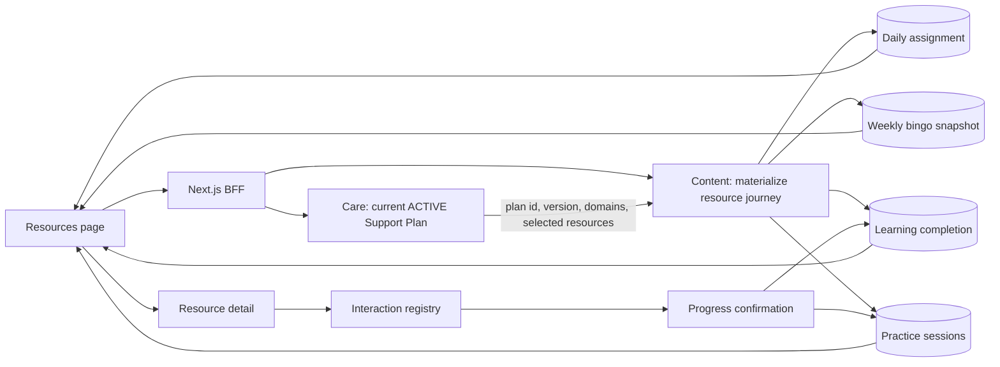

# MB-603 — Resources as a Support Plan journey

## Outcome

Resources is a projection of the authenticated user's current `ACTIVE` Support Plan. It is not a random catalogue playlist. The Content service persists a daily assignment and weekly bingo snapshot, while the frontend preserves the existing warm visual language and renders each resource through its declared interaction type.

The clinical boundary remains unchanged: resources are self-help and early-support material, not diagnosis, treatment, emergency response, or evidence of recovery.

## Domain model

| Concept                        | Meaning                                                                                                                                      |
| ------------------------------ | -------------------------------------------------------------------------------------------------------------------------------------------- |
| `resource_kind`                | `LEARNING`, `PRACTICE`, `HABIT`, `ACTION`, or `REFLECTION`.                                                                                  |
| `interaction_type`             | UI/behavior contract such as reader, video transcript, breathing pacer, grounding, walking timer, stretch sequence, or worksheet.            |
| `repeatability`                | `ONE_TIME` knowledge completion or `REPEATABLE` practice.                                                                                    |
| `completion_mode`              | Explicit confirmation, steps, timer, or video confirmation.                                                                                  |
| `resource_learning_completion` | One durable owner/resource completion. Unticking a later checklist does not erase it.                                                        |
| `resource_practice_session`    | One row per deliberately confirmed repeatable session; a client-generated ID makes retries idempotent and permits multiple sessions per day. |
| `resource_daily_progress`      | Editable per-day checklist state. Terminal completion remains terminal.                                                                      |
| `resource_daily_assignment`    | Stable owner/date snapshot of the Support Plan version and selected resources.                                                               |
| `resource_weekly_bingo`        | Stable owner/week snapshot derived from the plan-aligned candidate pool.                                                                     |

Learning progress, practice streak, and today's challenge are intentionally separate. A completed article/video contributes to learning progress, not practice streak. Streak only counts dates containing a completed session for a resource with `streak_eligible = true`.

## Navigation and data flow

The browser supplies only local date and IANA time zone. The BFF resolves the authoritative Support Plan; the browser cannot inject plan IDs or plan resource selections.

## Scheduling rules

- At most four resources per day.
- Prefer a balanced mix: unfinished learning, practice, habit/action, then reflection or another useful repeatable activity.
- Explicitly selected Support Plan resources outrank other resources carrying the plan's domain tags.
- Completed one-time learning is excluded from later learning slots.
- Repeatable resources always respect cooldown and `recommended_frequency_per_week`; the planner may return fewer than four items rather than silently bypass either limit.
- Plan Day 1–14 is derived from `activatedAt` in the user's IANA time zone. Dates before activation and after Plan Day 14 are not materialized.
- Stage order changes across orientation (days 1–3), core practice (4–7), reinforcement (8–10), maintenance (11–13), and review (14).
- The Plan-Day-based rotation is deterministic, and the result is persisted. Refreshing or returning to a day cannot reshuffle it.
- If all learning is consumed early, practice, habit, action and reflection resources remain available for the rest of a 14-day plan.
- Weekly bingo prioritizes repeatable plan-selected and plan-domain resources. Stamps come from actual daily completions/sessions, not catalogue order.

## Interaction registry and accessibility

The frontend registry maps `interaction_type` to reviewed configuration in `interaction_config`. Only `BREATHING_PACER` renders the breathing animation. Unknown or incomplete configuration falls back to a structured reader/checklist and never to breathing. Timers can be paused/resumed, controls are keyboard-native, completion requires confirmation, and reduced-motion behavior remains supported by the existing CSS.

## Complete seeded inventory

IDs below show the final three digits. All entries are Vietnamese. `D/A` means depression/anxiety plan tags.

### Current listed catalogue

| ID  | Resource                                    | Authoritative source                                                                                                                 | Kind / interaction                       | Repeatability / streak | Plan / completion                                   |
| --- | ------------------------------------------- | ------------------------------------------------------------------------------------------------------------------------------------ | ---------------------------------------- | ---------------------- | --------------------------------------------------- |
| 201 | Thở chậm trong 5 phút                       | [NHS breathing](https://www.nhs.uk/mental-health/self-help/guides-tools-and-activities/breathing-exercises-for-stress/)              | Practice / breathing pacer               | Repeatable / yes       | D/A / timed                                         |
| 202 | Grounding: quay về với hiện tại             | [WHO stress guide](https://www.who.int/publications/i/item/9789240003927)                                                            | Practice / grounding guide               | Repeatable / yes       | D/A / steps                                         |
| 203 | Nhận biết, gọi tên và đưa sự chú ý trở lại  | [WHO stress guide](https://www.who.int/publications/i/item/9789240003927)                                                            | Practice / unhooking prompts             | Repeatable / yes       | D/A / steps                                         |
| 204 | Một khoảng dừng tử tế với bản thân          | [CCI self-compassion](https://cci.health.wa.gov.au/Resources/Looking-After-Yourself/Self-Compassion)                                 | Practice / self-compassion prompts       | Repeatable / yes       | D/A / steps; human source review required           |
| 205 | Hiểu các dấu hiệu thường gặp của trầm cảm   | [NIMH depression](https://www.nimh.nih.gov/health/publications/depression)                                                           | Learning / structured reader             | One-time / no          | D / explicit                                        |
| 206 | Hiểu lo âu và những dấu hiệu thường gặp     | [NIMH GAD](https://www.nimh.nih.gov/health/publications/generalized-anxiety-disorder-gad)                                            | Learning / structured reader             | One-time / no          | A / explicit                                        |
| 207 | Chuẩn bị một nhịp ngủ dễ chịu hơn           | [NHS sleep](https://www.nhs.uk/every-mind-matters/mental-wellbeing-tips/how-to-fall-asleep-faster-and-sleep-better/)                 | Learning / structured reader             | One-time / no          | D/A / explicit                                      |
| 208 | Bắt đầu bằng một hoạt động nhỏ              | [NHS to-do list](https://www.nhs.uk/every-mind-matters/mental-wellbeing-tips/self-help-cbt-techniques/tackling-your-to-do-list/)     | Action / behavioral activation planner   | Repeatable / yes       | D / steps                                           |
| 209 | Giải quyết một vấn đề theo từng bước        | [NHS problem solving](https://www.nhs.uk/every-mind-matters/mental-wellbeing-tips/self-help-cbt-techniques/problem-solving/)         | Learning / structured reader             | One-time / no          | D/A / explicit                                      |
| 210 | 7 câu hỏi để nhìn lại một suy nghĩ khó chịu | [NHS thought record](https://www.nhs.uk/every-mind-matters/mental-wellbeing-tips/self-help-cbt-techniques/thought-record/)           | Reflection / reflection                  | Repeatable / no        | D/A / steps                                         |
| 211 | Dành một khoảng thời gian riêng cho nỗi lo  | [NHS worries](https://www.nhs.uk/every-mind-matters/mental-wellbeing-tips/self-help-cbt-techniques/tackling-your-worries/)           | Practice / reflection                    | Repeatable / no        | A / steps                                           |
| 212 | Chuẩn bị trước khi trao đổi với chuyên gia  | [NIMH provider tips](https://www.nimh.nih.gov/health/publications/tips-for-talking-with-your-health-care-provider)                   | Action / specialist checklist            | One-time / no          | D/A / steps                                         |
| 213 | Video: Thở chánh niệm ngắn                  | [NHS wellbeing tips](https://www.nhs.uk/every-mind-matters/mental-wellbeing-tips/top-tips-to-improve-your-mental-wellbeing/)         | Learning / video transcript              | One-time / no          | A / quiz confirmation; transcript review required   |
| 214 | Video: Nhìn lại những suy nghĩ chưa hữu ích | [NHS reframing](https://www.nhs.uk/every-mind-matters/mental-wellbeing-tips/self-help-cbt-techniques/reframing-unhelpful-thoughts/)  | Learning / video transcript              | One-time / no          | D/A / quiz confirmation; transcript review required |
| 215 | Video: Thư giãn cơ tiến triển               | [NHS health issues](https://www.nhs.uk/every-mind-matters/lifes-challenges/health-issues/)                                           | Learning / video transcript              | One-time / no          | D/A / quiz confirmation; transcript review required |
| 216 | Thả lỏng cơ theo từng vùng                  | [NCCIH relaxation](https://www.nccih.nih.gov/health/relaxation-techniques-what-you-need-to-know)                                     | Practice / progressive relaxation        | Repeatable / yes       | D/A / timed                                         |
| 217 | Đi bộ nhẹ trong 10 phút                     | [WHO physical activity](https://www.who.int/news-room/fact-sheets/detail/physical-activity)                                          | Habit / walk timer                       | Repeatable / yes       | D/A / timed                                         |
| 218 | Giãn cơ và đổi tư thế trong 7 phút          | [NHS activity](https://www.nhs.uk/every-mind-matters/mental-wellbeing-tips/be-active-for-your-mental-health/)                        | Habit / stretch sequence                 | Repeatable / yes       | D/A / steps; human review required                  |
| 219 | Giải quyết một vấn đề trong 10 phút         | [NHS problem solving](https://www.nhs.uk/every-mind-matters/mental-wellbeing-tips/self-help-cbt-techniques/problem-solving/)         | Practice / problem-solving worksheet     | Repeatable / yes       | D/A / steps                                         |
| 220 | Lên lịch một hoạt động nhỏ có ý nghĩa       | [NHS to-do list](https://www.nhs.uk/every-mind-matters/mental-wellbeing-tips/self-help-cbt-techniques/tackling-your-to-do-list/)     | Practice / behavioral activation planner | Repeatable / yes       | D / steps                                           |
| 221 | Một hành động nhỏ theo điều quan trọng      | [WHO stress guide](https://www.who.int/publications/i/item/9789240003927)                                                            | Action / unhooking-values prompts        | Repeatable / yes       | D/A / steps; human review required                  |
| 222 | Ba phút nhận biết hiện tại                  | [WHO stress guide](https://www.who.int/publications/i/item/9789240003927)                                                            | Practice / grounding guide               | Repeatable / yes       | D/A / steps; human review required                  |
| 223 | Nhìn lại điều hữu ích để tiếp tục           | [NHS staying on top](https://www.nhs.uk/every-mind-matters/mental-wellbeing-tips/self-help-cbt-techniques/staying-on-top-of-things/) | Reflection / reflection                  | Repeatable / no        | D/A / steps                                         |

### Legacy compatibility resources

Resources 101–106 remain in the database because existing Support Plans/publications can reference them. Migration 6 marks them `DIRECT_ONLY`; they are not silently deleted and do not enter the listed daily catalogue. Their deterministic migration defaults preserve API compatibility.

| ID  | Existing demo title / category                | Disposition                                                 |
| --- | --------------------------------------------- | ----------------------------------------------------------- |
| 101 | Bài thực hành thở chậm / Breathing            | Direct-only compatibility resource.                         |
| 102 | Hiểu về dấu hiệu trầm cảm / Article           | Direct-only; superseded in catalogue by 205.                |
| 103 | Hiểu về lo âu / Article                       | Direct-only; superseded by 206.                             |
| 104 | Bắt đầu một hoạt động nhỏ / Video             | Direct-only; superseded by the reviewed activation content. |
| 105 | Chuẩn bị cho giấc ngủ / Article               | Direct-only; superseded by 207.                             |
| 106 | Chuẩn bị trao đổi với chuyên gia / Journaling | Direct-only; superseded by 212.                             |

## Source ingestion and review

`npm run source:ingest -- --output <manifest.json>` reads resource source URLs, fetches and normalizes the source offline, hashes the normalized source, and emits a review artifact. It never scrapes at request time or marks content reviewed automatically. Review seed 11 records successful fetched hashes; fetch failures clear the invalid legacy hash and use `REVIEW_REQUIRED`, which the public repository and scheduler enforce.

WHO _Doing What Matters in Times of Stress_ is non-commercially adaptable under its stated CC BY-NC-SA 3.0 IGO terms; attribution and production legal review remain required. Third-party videos, translations, captions and the CCI source remain explicitly review-gated.

## Migrations and compatibility

- Normal migration `14_add_resource_experience_model.sql` adds semantic metadata and four owner-scoped persistence aggregates.
- Normal migration `15_harden_resource_journey.sql` permits multiple idempotent practice sessions per day and adds optional start/duration evidence.
- Review/demo migration `review1/7_seed_mb603_resource_experience.sql` enriches 201–215 and adds 216–223.
- Review/demo migrations 10–11 align timer data with displayed duration and replace derived-copy hashes with normalized fetched-source hashes.
- Existing resource creation remains valid through category-specific semantic defaults; admin create/update also accepts every semantic field explicitly.
- Existing daily progress rows are retained. A confirmed completion now additionally creates one durable learning completion or one repeatable practice session.

## Verification coverage

- Pure planner tests: balanced daily mix, completed-learning exclusion, deterministic bingo, practice streak.
- PostgreSQL integration: migration 14 and review seed 7 execute against PostgreSQL 16; existing repository and progress semantics remain green.
- Frontend component tests: journey dashboard, final-step confirmation, post-completion tick edits, video flow, safe interaction fallback.
- BFF test: only the authoritative current ACTIVE Support Plan is forwarded to Content.
- Final delivery also requires frontend/backend production builds, Resources Playwright, Docker health and log inspection.
