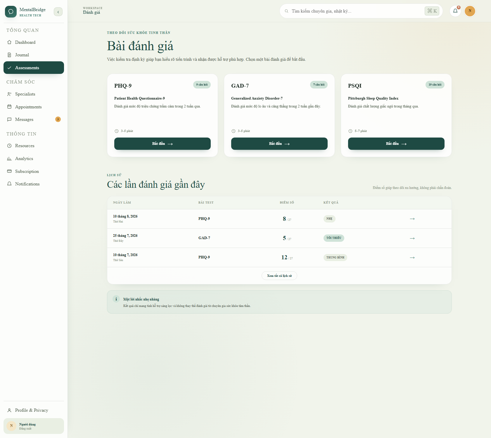

# FR-ASMT-02 Take Psychological Assessment

## Function Trigger

The function is triggered when an authenticated User selects **“Bắt đầu”** for an available assessment on `/assessments`, reviews the introduction at `/assessment/[type]`, and selects **“Bắt đầu bài đánh giá”**. The target system must validate the User's authenticated session and server-side authorization before returning an account-linked questionnaire or accepting a submission.

## Function Description

- **Actors / Roles:** Authenticated User
- **Purpose:** Allows a User to complete a supported psychological screening questionnaire and submit it for authoritative server-side scoring and safety evaluation.
- **Interface:** Assessment catalogue entry point, assessment introduction, progress indicator, one question at a time, answer options, previous-question control, submission state, and transfer to the separate assessment-result function.
- **Data Processing:**
  - Identify the User from the trusted authenticated session and ignore any client-supplied owner identity.
  - Retrieve a published, locale-appropriate questionnaire definition and preserve its immutable version identity.
  - Capture one valid answer for every required question and permit changes only before final submission.
  - Submit the answer set with an idempotency key; do not submit or trust a client-computed score.
  - Validate and score the assessment deterministically in Care Service, store the immutable submission, and evaluate safety-sensitive answers synchronously.
  - Return only the identifiers and safe result-routing data needed by the browser; detailed result display belongs to a separate function.

> **Historical snapshot — superseded by Sprint 2 runtime evidence.** The note
> and flow below record the pre-Sprint-2 frontend baseline and are not a
> current-runtime claim. Current authoritative behavior is the Care OpenAPI
> contract, Care/frontend implementation, and Sprint 2 runbook. Care owns
> scoring, ownership, idempotency, persistence, and safety evaluation.

## Screen Layout

- The page header displays **“Bài đánh giá”** and introductory screening guidance.
- Assessment cards display the instrument name, full name, description, question count, estimated duration, and **“Bắt đầu”** action.
- Selecting a card opens an introduction with **“Bắt đầu bài đánh giá”** and **“Để sau”** actions.
- The questionnaire screen displays progress, the current question, answer options, and **“← Câu trước”** when applicable.
- The recent-history table and result-detail controls visible on `/assessments` belong to separate View Assessment History and View Assessment Result functions and are outside this function's processing scope.
- The target interface must provide loading, stale-questionnaire, submission-error, and safe retry states without showing a result as saved until the server confirms acceptance.

## Function Details

### Data

| Field | Type | Required/Source | Validation/Display Rule | Business Rule |
|---|---|---|---|---|
| Assessment type | enum/string | Required; published questionnaire catalogue | Accept only a server-supported, published instrument. The current production data baseline defines PHQ-9 and GAD-7. The visible PSQI card remains a prototype until its questionnaire and scoring contract are approved. | BR-23, BR-41 |
| Questionnaire definition ID | opaque identifier | Required; Care Service | Must identify the exact published version served to the User; a stale or inactive definition cannot be submitted. | BR-41 |
| Questionnaire/scoring version | string | Required; Care Service | Preserve the content and scoring provenance used for the submission. Do not let the client choose or override it. | BR-41 |
| Locale | locale string | Required; User preference/request resolved by server | Display reviewed wording for the selected locale; use only an approved fallback locale when the preferred version is unavailable. | BR-41 |
| Question ID and prompt | opaque identifier and string | Required; questionnaire definition | Display questions in the authoritative server order. Do not expose internal safety-policy logic. | BR-08, BR-41 |
| Answer value | integer | Required; User input | For the current approved PHQ-9/GAD-7 baseline, accept only 0–3 and exactly one answer per question. | BR-07, BR-41 |
| Progress | derived non-negative integer/percentage | Derived in the client from the served question set | Display current position and completion progress; it is not authoritative submission data. | — |
| Idempotency key | protected opaque string | Required; client generated and server scoped to the authenticated User | Reuse for a retry of the same submission and prevent duplicate persisted attempts. Do not display or log it as health content. | — |
| Total score and screening level | non-negative integer and enum | Server computed | Never accept the client-computed value as authoritative. Present only in the separate result function and always as screening, not diagnosis. | BR-06, BR-41 |
| Safety flag/result | internal enum/boolean | Server derived | Evaluate synchronously from safety-sensitive answers; never rely only on total score or optional AI. | BR-08 |

### System Data

- Authenticated User ID obtained from the trusted server session.
- Effective role and authorization result obtained from trusted server-side data.
- Published questionnaire definition ID, instrument, locale, content version, and scoring version.
- Ordered question identifiers and validated answer values.
- Assessment submission ID, authoritative server score, screening level, and submission timestamp.
- Safety flags, deterministic safety-policy result, and approved immediate guidance reference when required.
- Idempotency key and non-sensitive correlation/audit metadata.
- Transactional event/outbox metadata required after a successful persisted submission; raw answers are not written to logs or unrestricted events.

### Validation & Business Rules

| Code | Rule Definition |
|---|---|
| BR-06 | Assessment is a screening tool and must not be presented as a diagnosis. |
| BR-07 | PHQ-9 contains nine questions scored 0–3; a completed PHQ-9 result cannot be edited. |
| BR-08 | A self-harm signal must trigger the approved safety process independently of the total score. |
| BR-21 | A hotline or support resource must be verified for owner, service scope, and operating hours before publication. |
| BR-23 | Mock data must not appear in production as real data. |
| BR-25 | Effective roles and permissions must come from trusted server-side authorization data. |
| BR-41 | The server must use an approved questionnaire version, validate the complete answer set, and calculate the authoritative score itself. |

### Validation

| Situation | Message | Handling |
|---|---|---|
| No valid authenticated session | — | Redirect to Sign In and do not return an account-linked questionnaire or accept answers. |
| Unsupported, unpublished, or unavailable assessment type | MSG-030 | Do not start the attempt; show the safe generic error state and allow return to `/assessments`. |
| Current question has no answer | MSG-012 | Keep the User on the current question and block forward progress or submission. |
| Answer is outside the authoritative option domain, duplicated, or refers to another questionnaire version | MSG-012 | Reject the invalid answer set; do not score or persist a completed submission. |
| Questionnaire version changed or became inactive before submission | MSG-037 | Reject the stale submission, discard it as a final result, and require a fresh questionnaire attempt. |
| Submission API fails before acceptance is confirmed | MSG-030 | Keep the local answers for a safe retry using the same idempotency key; do not display the result as saved. |
| The same submission is retried | — | Return the original accepted outcome for the same User and idempotency key without creating a duplicate. |
| Safety-sensitive answer is detected | — | Persist and score locally, invoke the approved synchronous safety path, and return immediate reviewed guidance without waiting for AI, Kafka, Redis, WebSocket, email, or push. |
| A support resource is unverified or unavailable | MSG-030 | Do not publish the unverified contact as active; use the approved safe fallback guidance. |
| Authorization or ownership check fails | — | Deny the request, persist no submission for another User, and disclose no assessment data. |

## Functionalities

### Normal Flow

1. The authenticated User opens `/assessments` and selects **“Bắt đầu”** for an available assessment.
2. The system validates the User's session and effective authorization under BR-25.
3. The system derives the owner identity from the trusted session and requests the selected published questionnaire definition from Care Service.
4. Care Service returns the authoritative instrument, definition ID, locale, version, ordered questions, and allowed answer options under BR-41.
5. The introduction page displays the assessment name, question count, estimated duration, privacy wording, and the non-diagnostic notice required by BR-06.
6. The User selects **“Bắt đầu bài đánh giá”** and the system displays the first question with progress information.
7. The User selects one allowed answer for the current question; the interface records the draft answer and advances to the next question.
8. The User may select **“← Câu trước”** and revise an answer before final submission.
9. The system blocks forward progress when the current question is unanswered and displays MSG-012.
10. After every required question has one valid answer, the client submits the definition ID and complete answer set with an idempotency key; it does not submit an authoritative score.
11. Care Service revalidates the session owner, questionnaire status/version, question membership, completeness, and answer domains under BR-41.
12. Care Service calculates the score and screening level deterministically, evaluates all safety-sensitive answers under BR-08, and stores the immutable submission and answers in one local transaction.
13. If safety guidance is required, the response includes the approved immediate guidance and only verified resources under BR-21 without waiting for optional dependencies.
14. The system confirms the accepted submission and transfers control to the separate View Assessment Result function using the server-issued submission ID.

### Historical Frontend Flow (pre-Sprint-2; superseded)

1. `/assessments` renders three static cards for PHQ-9, GAD-7, and PSQI plus three static history rows.
2. Each **“Bắt đầu”** link opens `/assessment/phq9`, `/assessment/gad7`, or `/assessment/psqi`; unsupported route values render Not Found.
3. `/assessment/[type]` renders static introduction content and supports **“Để sau”** navigation back to `/assessments`.
4. Every **“Bắt đầu bài đánh giá”** action, including GAD-7 and PSQI, navigates to `/assessment/anonymous`.
5. `/assessment/anonymous` always renders the same hard-coded nine-question PHQ-9 flow, stores answers only in React state, advances after a simulated 300 ms delay, and allows client-side back navigation.
6. The browser calculates the total and severity band locally, then displays the result immediately after the ninth answer without a backend request.
7. The current hotline is a fixed demonstration value and appears only when the client-computed total is greater than 9; PHQ-9 item 9 does not independently trigger the required BR-08 safety path.
8. No real session guard protects the dashboard route, no questionnaire/version API is called, no ownership check is performed, and no assessment, answer, score, or safety outcome is persisted.

### Abnormal Cases

- Missing or expired session → redirect to Sign In; do not return account-linked questionnaire data or accept a submission.
- Client-supplied User ID or role → ignore it and use trusted server session/authorization data under BR-25.
- Unsupported or unpublished instrument → show MSG-030 and return safely to the assessment catalogue.
- Unanswered or invalid current response → display MSG-012 and block progress.
- Incomplete, duplicated, out-of-range, or cross-version answer set → reject the submission and persist no completed result.
- Stale questionnaire definition → display MSG-037 and require a new attempt using the current published version.
- Network or Care Service failure → display MSG-030, retain the draft locally for safe retry, and do not claim that the result was saved.
- Duplicate retry after an uncertain response → use the same idempotency key and return the original outcome without creating another submission.
- Safety-sensitive response → execute the approved synchronous safety process regardless of total score; do not wait for AI or notification delivery.
- Unverified support contact → do not display it as active; use approved fallback guidance under BR-21.
- Authorization mismatch → deny access, persist nothing for another User, and disclose no assessment data.

## Post-Conditions

- **PC-01:** On success, one complete assessment submission is stored for the authenticated User against the exact questionnaire and scoring versions used.
- **PC-02:** The authoritative answer set, score, screening level, safety flag, and submission time are immutable; later correction requires a separate void-and-new-attempt process.
- **PC-03:** The browser receives only the accepted submission identifier and safe data required to transfer to the separate result function; the result remains screening information, not diagnosis.
- **PC-04:** Any required immediate safety guidance has been evaluated synchronously, and downstream events/notifications are non-blocking follow-up only.
- **PC-05:** On validation, authorization, stale-version, or unconfirmed submission failure, no completed assessment is created and no result is represented as saved.

## BR and MSG Registry Reference

All codes below are defined once in the MentalBridge Master Registry:

| Code | Type | Usage in this function |
|---|---|---|
| BR-06 | Business Rule | Requires non-diagnostic screening wording. |
| BR-07 | Business Rule | Defines PHQ-9 answer count/range and completed-result immutability. |
| BR-08 | Business Rule | Requires an independent self-harm safety path. |
| BR-21 | Business Rule | Prevents publication of unverified hotline/support contacts. |
| BR-23 | Business Rule | Prevents prototype assessment data from appearing as production truth. |
| BR-25 | Business Rule | Requires trusted server-side role and authorization data. |
| BR-41 | Business Rule | Requires a published questionnaire version, server validation, and authoritative server scoring. |
| MSG-012 | Validation | Blocks progress when the required assessment answer is missing or invalid. |
| MSG-030 | Error | Handles safe generic loading/submission failures. |
| MSG-037 | Validation/Error | Requires restart when the questionnaire version is stale or inactive. |
